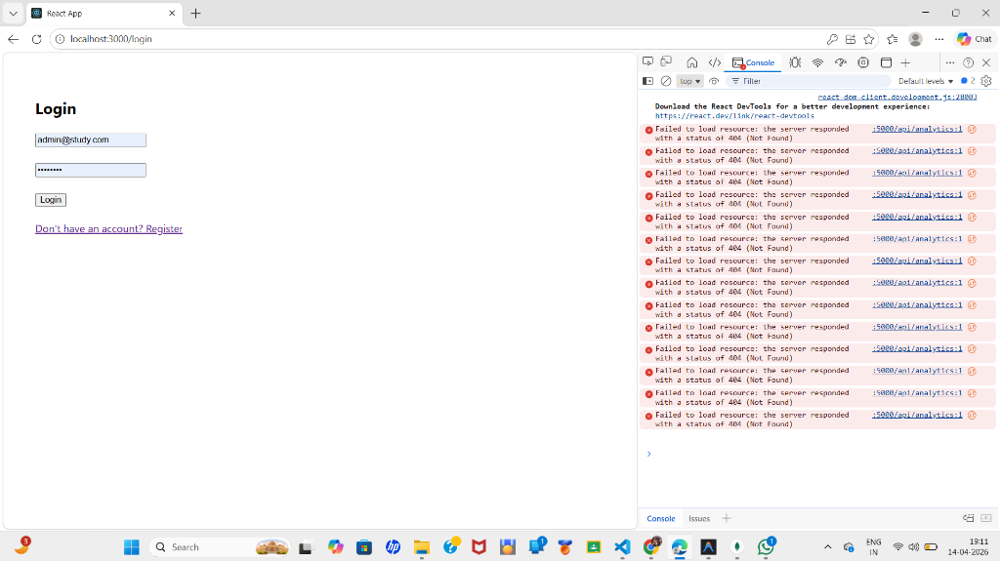
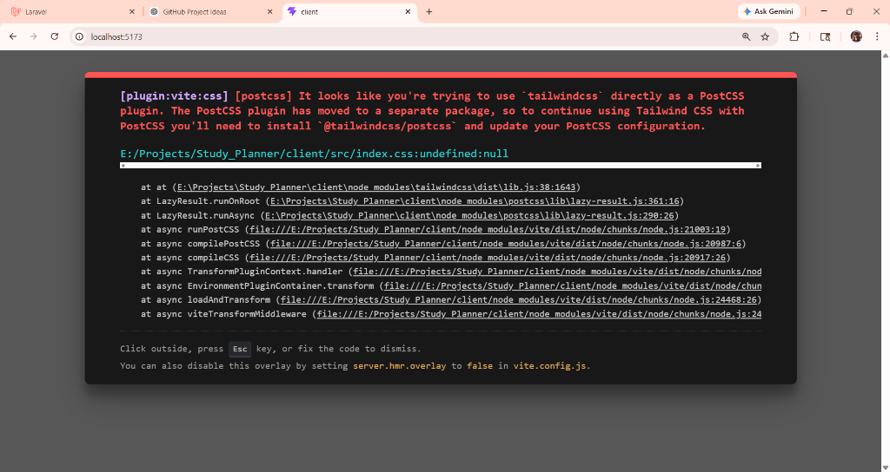
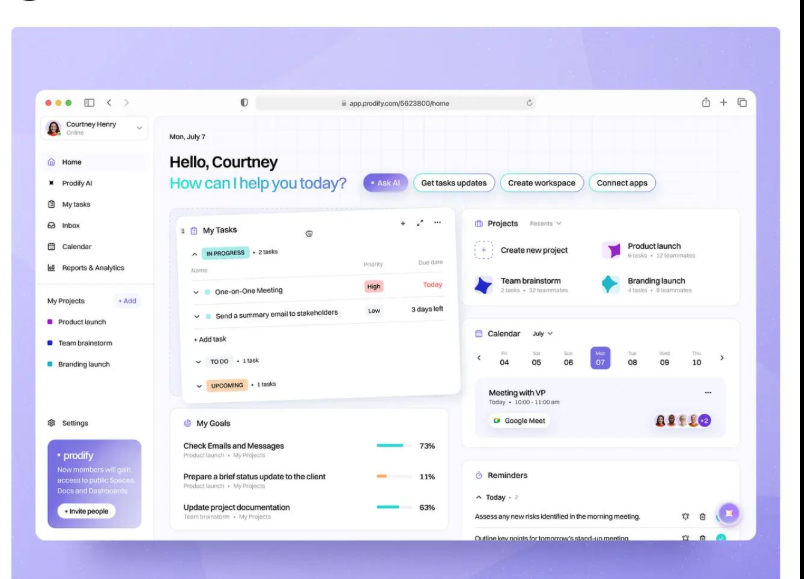
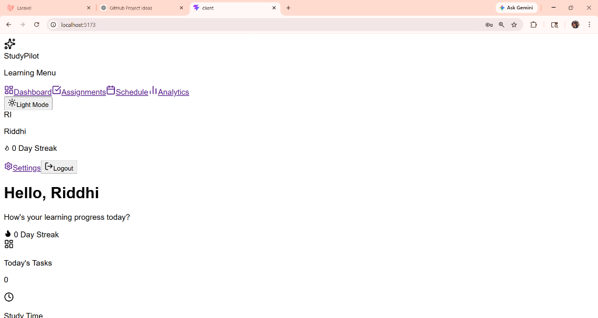

# 🎓 AI Study Planner & Productivity SaaS


> **Transform your learning journey with a premium, AI-driven study ecosystem built for elite academic performance.**

---

## 🌟 Overview
The **AI Study Planner** is a full-stack SaaS application designed to empower students with intelligent task management, deep-work optimization, and personalized analytics. Inspired by the clean aesthetics of Notion and the gamification of Duolingo, it offers a high-fidelity experience that makes productivity feel like a game.

---

## ✨ Core Features

### 🤖 AI Study Assistant
- **Smart Planning**: Generate optimized study schedules based on your specific subjects and deadlines.
- **Native Chatbot**: A floating AI assistant always ready to answer questions, summarize notes, or provide motivation.
- **Smart Insights**: Real-time periodic feedback on your study habits and focus scores.

### ⏱️ Deep Work & Focus Mode
- **Cinematic Timer**: A dedicated "Flow State" overlay with a circular SVG progress ring and ambient dimming.
- **Focus Scoring**: Automatically calculates your concentration levels based on session data.

### 📊 Intelligence Dashboard
- **KPI Metrics**: Real-time cards tracking Study Time, Tasks Done, Streak, and Focus Score.
- **Analytics Hub**: High-fidelity charts (Recharts) visualizing your weekly momentum and subject distribution.
- **Activity Heatmap**: A GitHub-style contribution graph for your study consistency.

### 🎮 Gamification System
- **XP & Leveling**: Earn experience points for every completed task and study session.
- **Level Progress**: Visual progress bars and milestone tracking.
- **Badges**: Unlockable achievements as you build long-term study streaks.

---

## 🎨 Visual Gallery

| Dashboard Overview | Focus Mode UI |
| :---: | :---: |
|  |  |

| Dark Mode View | Analytics Hub |
| :---: | :---: |
|  |  |

---

## 🛠️ Tech Stack

- **Frontend**: 
  - React 19 (Hooks, Context API)
  - Tailwind CSS (Premium SaaS UI Design)
  - Framer Motion (Page Transitions & Micro-animations)
  - Recharts (Interactive Data Visualization)
  - Lucide React (Icon System)
- **Backend**:
  - Node.js & Express
  - MongoDB (Mongoose ODM)
  - JWT (Secure Authentication)
- **Security**:
  - Helmet.js (Security Headers)
  - Express-Rate-Limit (DDOS Protection)

---

## 🚀 Getting Started

### 1. Prerequisites
- Node.js (v18+)
- MongoDB (Running locally or MongoDB Atlas URI)

### 2. Backend Setup
```bash
cd server
npm install
```
Create a `.env` file in the `server` directory:
```env
PORT=5000
MONGO_URI=your_mongodb_uri
JWT_SECRET=your_super_secret_key
```
Run the server:
```bash
node server.js
```

### 3. Frontend Setup
```bash
cd client
npm install
npm start
```

---

## 🔑 Default Access
- **Admin Email**: `admin@study.com`
- **Password**: `admin123`
*(Admin access allows you to manage users, view system-wide audits, and toggle user account status.)*

---

## 📁 Repository Structure
```text
StudyPlannerWithAI/
├── client/              # React frontend & Tailwind config
├── server/              # Express backend & API modules
├── screenshots/         # UI Showcase images
└── README.md            # Project documentation
```

---

> [!TIP]
> **Pro Tip**: Use the **Focus Mode** (Target icon in the Dashboard) for 25 minutes to maximize your focus score and earn bonus XP!

